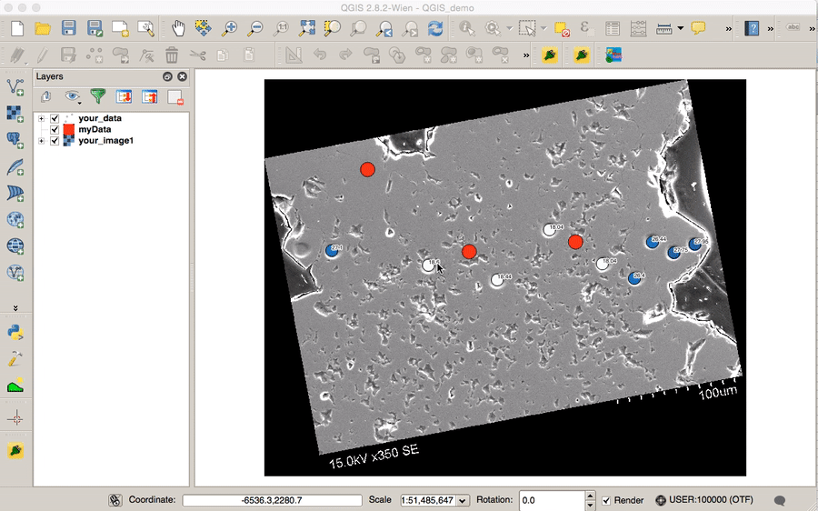

Line Profile
====


Line Profile plugin is a [QGIS](http://www.qgis.org) plugin to make line profiles of vector and raster layers for [micro-QGIS](https://sites.google.com/a/wisc.edu/wiscsims-micro-qgis/).

## Requirement
This plugin is using following python modules:
* [GDAL Complete 1.11 framework package](http://www.kyngchaos.com/software/frameworks#gdal_complete)
* [Matplotlib Python module](http:/http://www.kyngchaos.com/files/software/python//www.kyngchaos.com/software/python)
* [NumPy](http://www.numpy.org/)

## Installation
The most recent development version of Line Profile is available through the repository hosted on Github.

**With git command**
 * **macOS (terminal)**
 ```sh
 cd ~/.qgis2/python/plugins
 git clone https://github.com/saburo/LineProfile.git
 ```
 * **Windows (command prompt)**
 ```bash
 cd %HOMEPATH%\.qgis2\pthon\plugins
 git clone https://github.com/saburo/LineProfile.git
 ```

**Without git command**
* Donwload zip file from [here](https://github.com/saburo/LineProfile/archive/master.zip)
* Unzip file and rename folder to "LineProfile"
* Copy the "LineProfile" folder to QGIS plugin folder:
 * **macOS:** "`/Users/your-username/.qgis2/python/plugins`"
 * **Windows:** "`C:\Users\your-username\.qgis2\pthon\plugins`"

After the installation of LineProfile, launch QGIS, then click on the checkbox for the LineProfile in the `Manege and Install Plugins` window.

## Usage
Launch LineProfile from `Plugins > Line Profile` menu or by clicking the WiscSIMS button in the plugin toolbar.

#### Adding data:
Select one of the layers in the Layers Panel of your QGIS project, then click `Add Data` button at middle-right of the LineProfile widget. You can select a data in the layer from dropdown menu in the pop-up window.

#### Drawing profile line:
 * __Left click__: Create a vertex of profile line
 * __Right click__: Terminate profile line
 * __Double left click__: Cancel/remove profile line

#### Plotting a profile:
Line profile is automatically drawn/updated when profile line is terminated.

#### Select plot options:
You can bring up plot option window by double click on cog icon right side of each data in the listbox.

## Plot Options
Both raster and vector layers have following options.

#### Raster layer:
 * Full resolution (every pixels will be sampled)
 * Moving average
 * Area sampling

#### Vector layer:
 * Maximum distance from the profile line
 * Tie-lines between data point and profile line

#### Common:
 * Plot color
 * Enable/disable

#### Developmental:
 * Display sampling area for area sampling
 * Display sampling spots for area sampling
 * Normalize distance (x) of `Profile Line 2` to `Profile Line 1`

## Options
* Export profile data as a text file (csv, tab deliminated)
* Import/Export profile line

## Other features
* Display a white marker on a profile line which indicates current cursor position in the profile line plot
* Display tie lines that represent projected positions of features (data point) on a profile line
* Seconday profile line
* Save plot as a image (PDF, PNG, JPG, SVG)

## Licence
See the [LICENSE](LICENSE) file for license rights and limitations (GNU v3.0).

## Author
Kouki Kitajima @ WiscSIMS [[saburo](https://github.com/saburo)]
